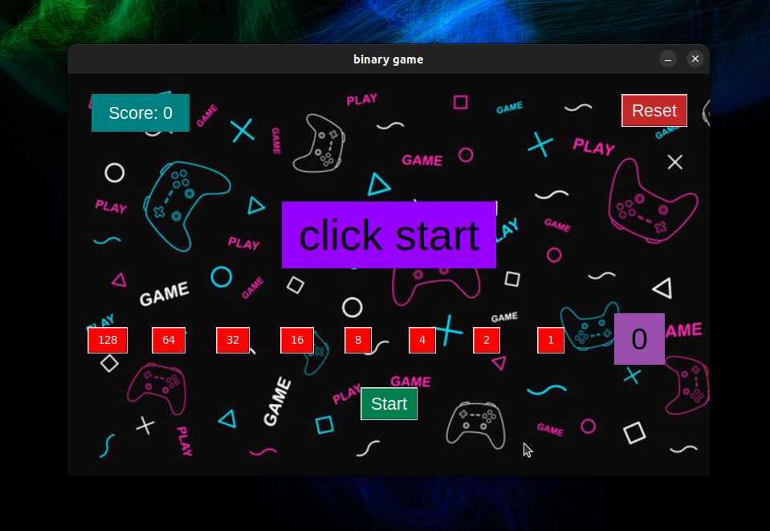
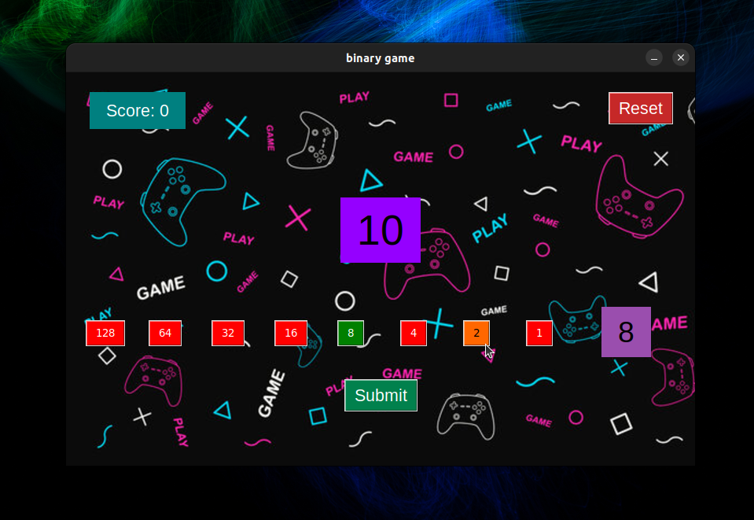
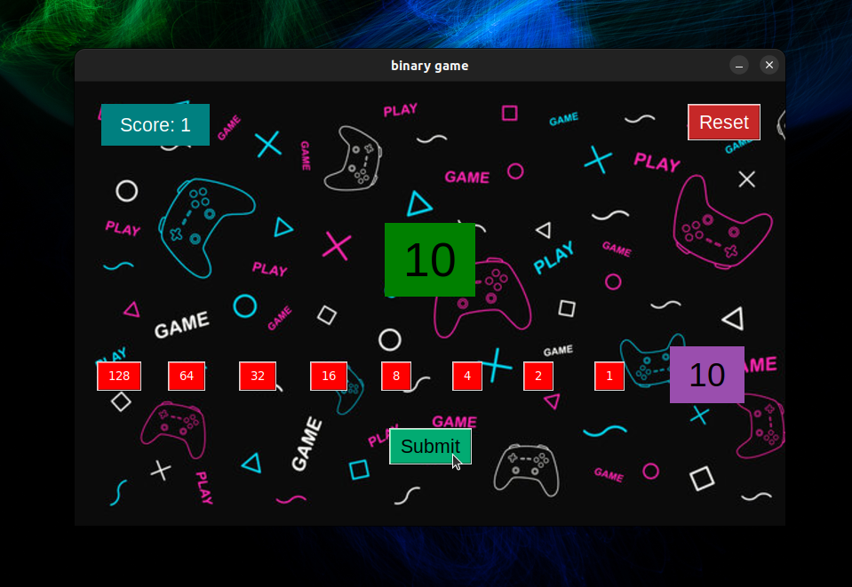

# Binary Game

## Description

The Binary Game is a fun and educational game designed to help players understand binary numbers and improve their mental arithmetic skills. The game generates random numbers and challenges the player to match these numbers using binary buttons. The game interface is built using Tkinter in Python.

## Demo

Here are some screenshots of the game in action:

### Main Screen



### Gameplay





## Features

- **Random Number Generation**: Generates random numbers based on the number of clicks.
- **Binary Buttons**: Players can use buttons representing binary values to sum up to the displayed number.
- **Score Tracking**: Keeps track of the player's score based on correct and incorrect attempts.
- **Dynamic Background and Interface**: Uses images and color changes to provide visual feedback.
- **Reset Functionality**: Allows players to reset the game at any time.

## Requirements

- Python 3.x
- Tkinter (usually included with Python installations)
- An image file named `gamebg.png` for the background

## Installation

1. Clone this repository or download the source code.
2. Ensure you have Python 3 installed on your system.
3. Install any necessary dependencies (Tkinter is usually included with Python).

## Usage

1. Run the `binary_game.py` script to start the game.
   ```bash
   python binary_game.py
   ```
2. Click the "Start" button to generate a random number.
3. Use the binary buttons to match the displayed number.
4. Click the "Submit" button to check your answer.
5. The score will update based on your correct or incorrect attempts.
6. Click the "Reset" button to restart the game at any time.

## How to Play

- **Starting the Game**: Click the "Start" button to begin. A random number will appear in the center of the screen.
- **Using the Binary Buttons**: Click the buttons representing binary values (2^0, 2^1, 2^2, etc.) to sum up to the displayed number. The button color will change to indicate its selection.
- **Submitting Your Answer**: Once you believe your selection matches the displayed number, click the "Submit" button. The background color of the displayed number will change to green for a correct answer and red for an incorrect answer.
- **Resetting the Game**: Click the "Reset" button to clear all selections and reset the score.

## File Structure

- `binary_game.py`: The main script that runs the game.
- `gamebg.png`: The background image used in the game.

## Code Overview

### Main Functions

- `random_number()`: Generates a random number based on the click count and updates the display.
- `equality()`: Checks if the sum of selected binary values matches the displayed number.
- `reset_fn()`: Resets the game, clearing all selections and resetting the score.
- `summation()`: Calculates the total sum of selected binary values and updates the display.

### Classes

- `CreateButton`: Represents a binary button. Handles the button's state (selected/unselected) and its value.

## License

This project is licensed under the MIT License. See the [LICENSE](LICENSE) file for details.

## Acknowledgments

- The Tkinter library for providing the GUI framework.
- Python for being an excellent programming language for this project.

Enjoy playing the Binary Game and improving your binary number skills!
